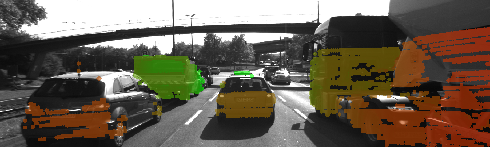

# 3D-Points-on-Image
This repository implements a method to project points in 3D-space(collected from a Velodyne LiDAR) on to an image captured from a RGB Camera. The implementation takes in an image and LiDAR point cloud data, and projects the 3D lidar points over the image. Both the image and lidar pointcloud have been used from the [KITTI dataset](http://www.cvlibs.net/datasets/kitti/).
 

## Method 

- Both intrinsic and extrinsic (LiDAR to Camera transformation matrices [R|T]) are available in KITTI dataset.
- In the implementation, `P_rect_00`, and `R_rect_00` form the intrinsic camera parameters where `P_rect_00` is the camera matrix and `R_rect_00` is the rectifiaction matrix to make the image co-planar.
- `RT` matrix that can be best represented as [R|T] transformation matrix provides the extrinsic relation between the camera and LiDAR co-ordinate frames.
- The final projection of each point in 3D space on to the image plane can be given by:
```

Y(image point) = P_rect_00 x R_rect_00 x RT x X(3D LiDAR point)

```
- The LiDAR points are scanned in a 360 degrees space and hence even the points scanned behind the vehicle or camera are projected on the image. To avoid this, we eliminate all the points behind the vehicle and outside the camera frame.
 


## Results
The resulting overlay image is shown below.

### Original Image


### Overlay Image



## Implementation

The code skeleton for this project is as follows

The `src` directory in this repository contains all the files listed below:
```
.
├── lidar_camera.cpp
├── utils.cpp
├── utils.hpp
└── dataStructures.h
```


## Dependencies

* cmake >= 2.8
  * All OSes: [click here for installation instructions](https://cmake.org/install/)
* make >= 4.1 (Linux, Mac), 3.81 (Windows)
  * Linux: make is installed by default on most Linux distros
  * Mac: [install Xcode command line tools to get make](https://developer.apple.com/xcode/features/)
  * Windows: [Click here for installation instructions](http://gnuwin32.sourceforge.net/packages/make.htm)
* gcc/g++ >= 5.4
  * Linux: gcc / g++ is installed by default on most Linux distros
  * Mac: same deal as make - [install Xcode command line tools](https://developer.apple.com/xcode/features/)
  * Windows: recommend using [MinGW](http://www.mingw.org/)
* OpenCV >= 3.0
* OpenMP 

## Build

1. Clone this repo.
2. Make a build directory: `mkdir build && cd build`
3. Compile: `cmake .. && make` 
4. Run it: `./lidar_camera ./0000000000.png ./dat/C51_LidarPts_0000.dat`

